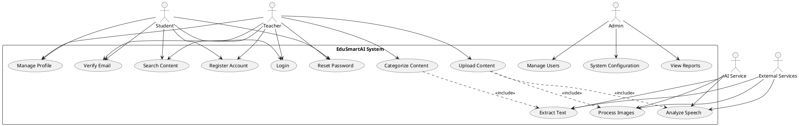
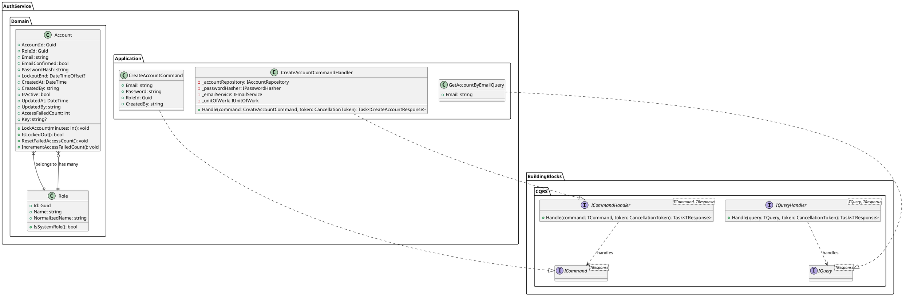
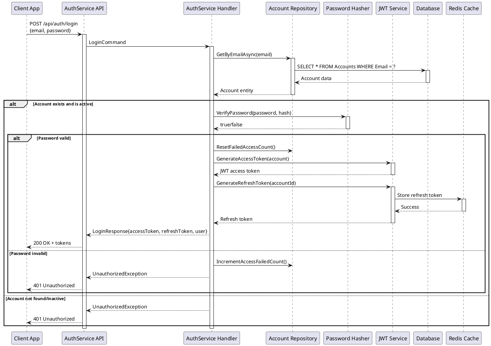
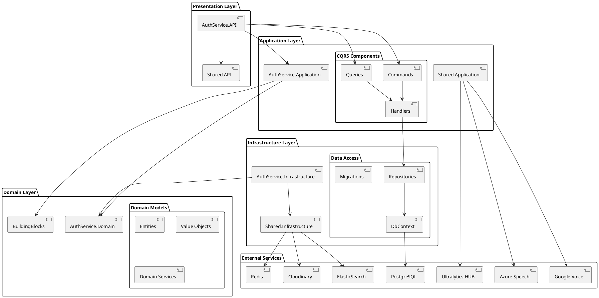
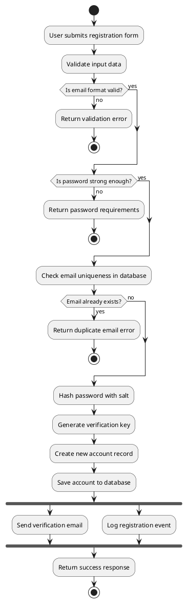
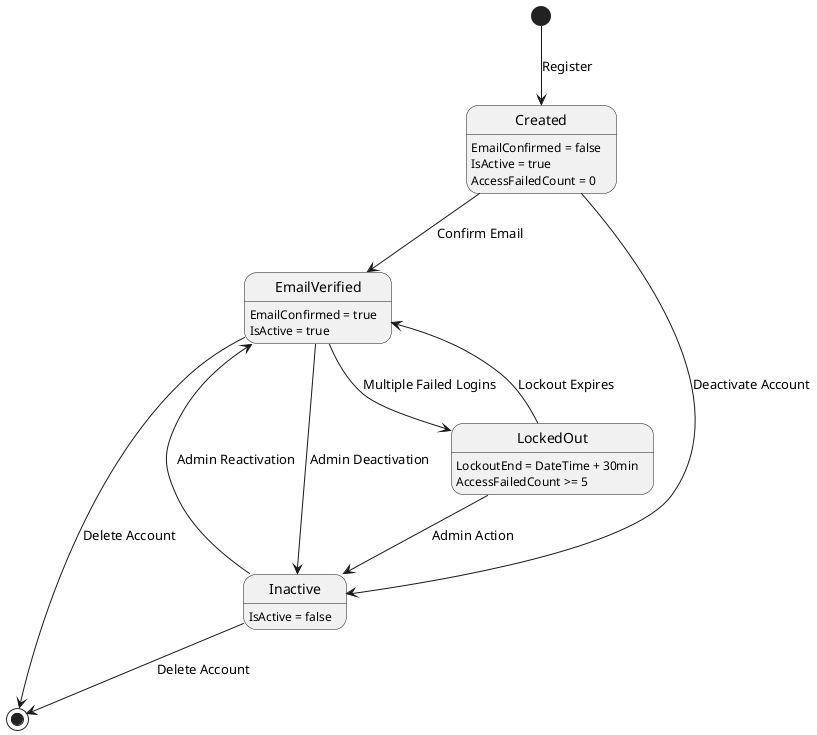

# UML 2.0 Design Models
## EduSmartAI Backend System

### 1. Use Case Diagram



### 2. Class Diagram - Domain Model



### 3. Sequence Diagram - Authentication Flow



### 4. Component Diagram - System Architecture



### 5. Deployment Diagram - Google Cloud Platform

```plantuml
@startuml EduSmartAI_Deployment

node "Google Cloud Platform" {
    
    node "Google Kubernetes Engine" as GKE {
        node "Load Balancer" as LB {
            component [Google Cloud Load Balancer]
        }
        
        node "AuthService Cluster" {
            node "Pod 1" {
                component [AuthService.API]
                component [AuthService.App]
            }
            node "Pod 2" {
                component [AuthService.API]
                component [AuthService.App]  
            }
            node "Pod 3" {
                component [AuthService.API]
                component [AuthService.App]
            }
        }
        
        node "Shared Services Cluster" {
            node "Pod 1" {
                component [Shared.API]
                component [AI Services]
            }
            node "Pod 2" {
                component [Shared.API] 
                component [AI Services]
            }
        }
    }
    
    node "Cloud SQL" {
        database "Primary DB" as PrimaryDB {
            component [PostgreSQL Primary]
        }
        database "Read Replica" as ReplicaDB {
            component [PostgreSQL Replica]
        }
    }
    
    node "Memorystore" {
        database "Redis Cluster" as RedisCluster {
            component [Redis Node 1]
            component [Redis Node 2] 
            component [Redis Node 3]
        }
    }
    
    node "Cloud Storage" {
        storage "Media Storage" as MediaStorage
        storage "Backup Storage" as BackupStorage
    }
}

node "External Services" {
    cloud "Ultralytics HUB" as UltraCloud
    cloud "Azure Services" as AzureCloud
    cloud "Google AI Services" as GoogleAI
    cloud "Cloudinary CDN" as CloudinaryCDN
}

' Connections
LB --> AuthService Cluster
LB --> "Shared Services Cluster"
AuthService Cluster --> PrimaryDB
AuthService Cluster --> RedisCluster
"Shared Services Cluster" --> ReplicaDB
"Shared Services Cluster" --> UltraCloud
"Shared Services Cluster" --> AzureCloud
"Shared Services Cluster" --> GoogleAI
"Shared Services Cluster" --> CloudinaryCDN

PrimaryDB --> ReplicaDB : replication
MediaStorage --> CloudinaryCDN

@enduml
```

### 6. Activity Diagram - Account Registration Process



### 7. State Diagram - Account Status


